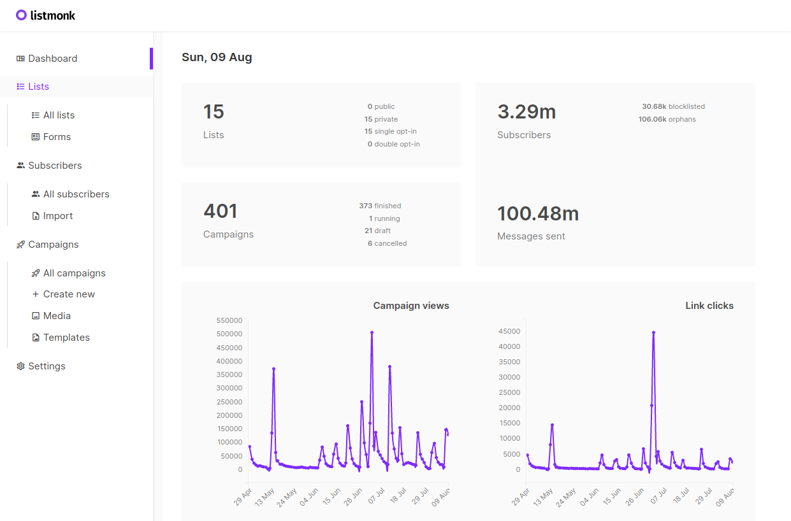

# Introduction

listmonk is a self-hosted, full fledged, high performance mailing list and newsletter manager. It comes as a standalone binary and the only dependency is a Postgres database.

!!! warning "Alpha software"

> listmonk is **alpha** software and may change and break. Use with caution. That said, it has been in active use at [zerodha.com](https://zerodha.com) for several months where it has processed hundreds of campaigns and tens of millions of e-mails.

### Installation

- Download the [latest release](https://github.com/knadh/listmonk/releases) and extract the listmonk binary somewhere.
- Copy `config.toml.sample` to `config.toml` and add your configuration (SMTP and Postgres DB credentials primarily).
- `./listmonk --install` to setup the DB.
- Visit `http://localhost:9000`.
- Since there is no user auth yet, it's best to put listmonk behind a proxy like Nginx and setup basicauth on all endpoints except for the few endpoints that need to be public. Here is a [sample nginx config](https://github.com/knadh/listmonk/wiki/Production-Nginx-config) for production use.

### Running on docker

[Read this](https://github.com/knadh/listmonk#running-on-docker) to run listmonk on a Docker container.

## Developers

listmonk is free, open source software licensed under AGPLv3. There are a few of essential features such as user auth/management and bounce tracking that are currently missing. Contributions are welcome.

The backend is written in Go and the frontend is in React with Ant Design for UI. See [developer setup](https://github.com/knadh/listmonk/wiki/Developer-setup) to get started.
